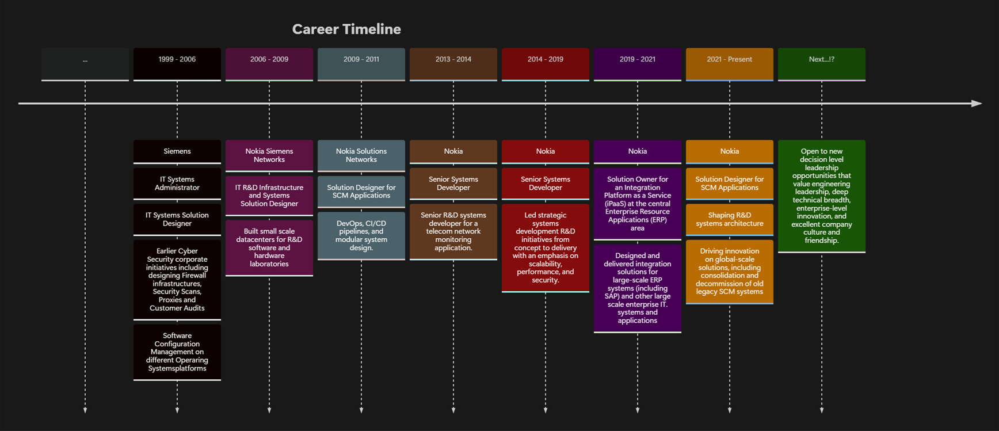

With over **_25 years of experience_**, _Hugo Monteiro_ has delivered impactful **IT and R&D solutions** across some of the world’s largest technology corporations.  
With a broad full-spectrum expertise across all layers of technology—from hardware and embedded systems, to datacenter management, networks, cyber security, **cloud platforms** integration, **ERP** cross-application integration, integration platforms as a service (**iPaaS**), application **development** and full-cycle product release management (**DevOps** and **CI/CD**), _Hugo_ has done it all in the technical side of the industry.

Located in _Lisbon_ - _Portugal_, he is currently employed and works at ***Nokia*** as member of the **Nokia’s Center of Excellence** as a **IT Solution Designer**, contributing to high-level application architecture, systems integration, and innovation at scale, and currently plays a strategic role in the **Software Configuration Management** (SCM) team responsible for **R&D DevOps** platforms that manage the entire software development lifecycle for all **Nokia's** product offerings.  

_Hugo_ has a strong business oriented profile, and has successfully managed cross-functional teams in diversified multi-cultural environments, led complex project lifecycles, and delivered secure, scalable, and maintainable systems and applications across a range of industries, and is a strong corporate governance advocate.

You can visit and contact him through his official LinkedIn profile [here](https://www.linkedin.com/in/hvmonteiro/).

  
## Contact

Or through his email (_if you find it - not publicly available due to SPAM_), or his other Social Media profiles.

