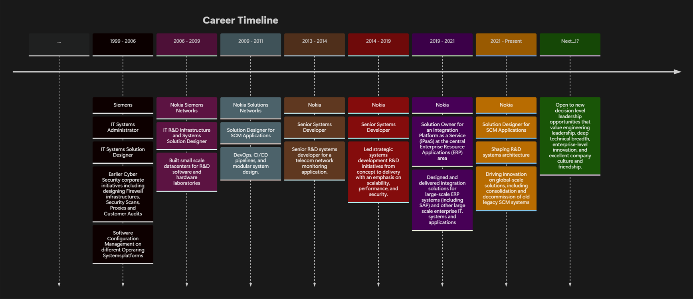

With more than **25 years of experience**, I have delivered impactful **IT and R&D solutions** across some of the world's largest technology corporations.

My experience spans the technology stack: hardware and embedded systems, data center management, networks, cybersecurity, **cloud platforms**, **ERP** and cross-application integration, integration platforms as a service (**iPaaS**), application **development**, and full-cycle product release management with **DevOps** and **CI/CD**.

Based in Lisbon, Portugal, I currently work at ***Nokia*** as an **IT Solution Designer** in **Nokia's Center of Excellence**. I contribute to high-level application architecture, systems integration, and innovation at scale. I also play a strategic role in the **Software Configuration Management** (SCM) team responsible for the **R&D DevOps** platforms that support the software development lifecycle across Nokia's product portfolio.

I bring a strong business perspective to technical work. I have managed cross-functional teams in multicultural environments, led complex project lifecycles, and delivered secure, scalable, and maintainable systems and applications across several industries. I am also a strong advocate for corporate governance.

You can learn more about my work and contact me through [LinkedIn](https://www.linkedin.com/in/hvmonteiro/).

  
## Contact

You can also reach me by email—if you find it, since I do not publish it because of spam—or through my other social media profiles.
